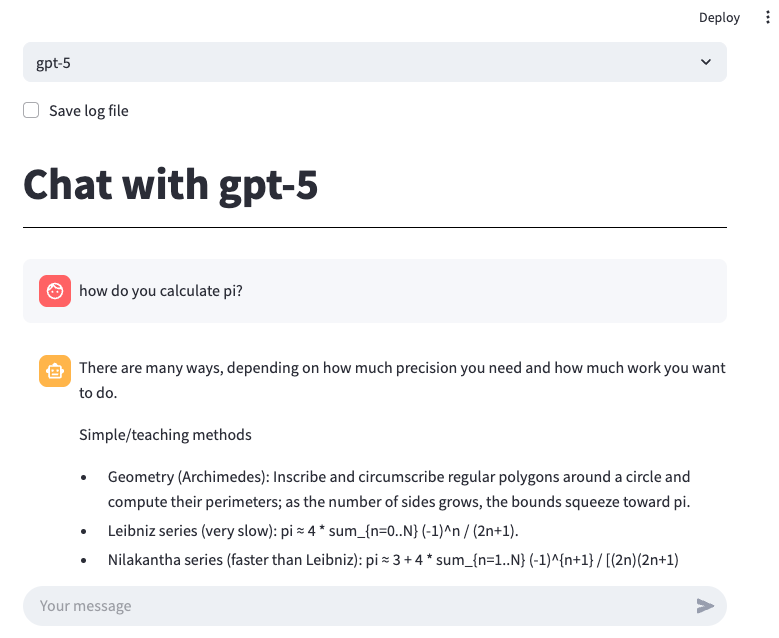
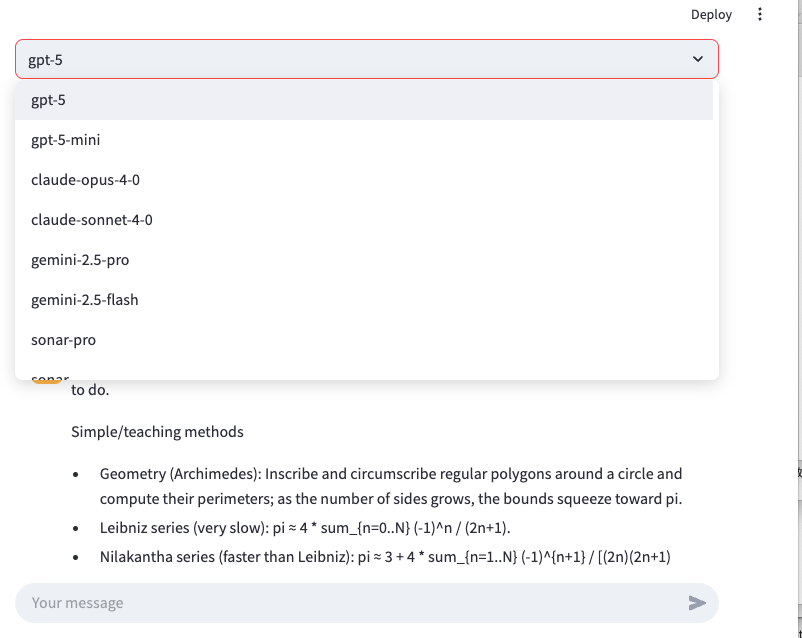

[ [English](index.md) 日本語 ]

# multiai

`multiai`は、OpenAI、Anthropic、Google、Perplexity、Mistral、DeepSeek、xAIのテキスト生成AIモデルとやり取りするためのPythonライブラリおよびコマンドラインツールです。このマニュアルでは、`multiai`のインストール、設定、および使用方法について説明します。

## 目次

- [対応しているAIプロバイダーとモデル](#対応しているaiプロバイダーとモデル)
- [主な機能](#主な機能)
- [はじめに](#はじめに)
  - [インストール](#インストール)
  - [環境設定](#環境設定)
  - [基本的な使い方](#基本的な使い方)
  - [インタラクティブモードの詳細](#インタラクティブモードの詳細)
  - [設定](#設定)
    - [設定ファイル](#設定ファイル)
    - [モデルとプロバイダーの選択](#モデルとプロバイダーの選択)
    - [APIキー管理](#apiキー管理)
- [高度な使用法](#高度な使用法)
  - [モデルパラメータ](#モデルパラメータ)
  - [入力オプション](#入力オプション)
  - [出力オプション](#出力オプション)
  - [コマンドラインオプション](#コマンドラインオプション)
- [Text-to-Speech 拡張機能](#text-to-speech-拡張機能)
- [Pythonライブラリとしての`multiai`の使用](#pythonライブラリとしてのmultiaiの使用)
  - [テキストファイルを翻訳するスクリプト](#テキストファイルを翻訳するスクリプト)
  - [ローカルチャットアプリの実行](#ローカルチャットアプリの実行)
  - [Google Colabでの実行](#google-colabでの実行)
- [レスポンス添付ファイル対応](#レスポンス添付ファイル対応)

## 対応しているAIプロバイダーとモデル

`multiai`は、以下のプロバイダーのAIモデルとやり取りすることができます。

| AIプロバイダー   | Webサービス                       | 使用可能なモデル                                             |
|-----------------|----------------------------------|------------------------------------------------------------|
| **OpenAI**      | [ChatGPT](https://chatgpt.com/) | [GPTモデル](https://platform.openai.com/docs/models) |
| **Anthropic**   | [Claude](https://claude.ai/) | [Claudeモデル](https://docs.anthropic.com/en/docs/about-claude/models) |
| **Google**      | [Gemini](https://gemini.google.com/)| [Geminiモデル](https://ai.google.dev/gemini-api/docs/models/gemini)  |
| **Perplexity** | [Perplexity](https://www.perplexity.ai/) | [Perplexityモデル](https://docs.perplexity.ai/guides/model-cards) |
| **Mistral**  | [Mistral](https://chat.mistral.ai/chat) | [Mistralモデル](https://docs.mistral.ai/getting-started/models/) |
| **DeepSeek**  | [DeepSeek](https://chat.deepseek.com/) | [DeepSeekモデル](https://api-docs.deepseek.com/quick_start/pricing) |
| **xAI**  | [xAI](https://grok.com/) | [xAIモデル](https://docs.x.ai/docs/models) |
| **Local LLM**  | [Ollama](https://ollama.com/) | [Ollamaモデル](https://ollama.com/search) |

- DeepSeek と Local LLM はバージョン 1.1.0 以上が必要。xAI はバージョン 1.2.0 以上が必要。ファイル添付機能はバージョン 1.4.0 以上が必要。詳しくは[リリース](release.md)参照。

## 主な機能

- **インタラクティブチャット:** ターミナルから直接AIと対話できます。
- **複数行入力:** 複雑なクエリのために複数行のプロンプトをサポートします。
- **長文応答のページャー:** 長い応答をページャーで表示できます。
- **継続処理:** 応答が途中で切れた場合に、続きのリクエストを自動的に処理します。
- **自動チャットログ:** チャット履歴を自動的に保存できます。
- **ファイル添付（1.4.0で追加）:** ファイルを文脈として添付できます。

## はじめに

### インストール

`multiai`をインストールするには、以下のコマンドを使用してください：

```bash
pip install multiai
```

### 環境設定

`multiai`を使用する前に、選択したAIプロバイダーのAPIキーを[APIキー管理](#apiキー管理)に従って設定してください。

### 基本的な使い方

APIキーの設定が完了したら、AIとの対話を開始できます。

- 簡単な質問を送信するには：

  ```bash
  ai こんにちは
  ```

  以下のような応答が表示されるはずです：

  ```bash
  gpt-4o-mini>
  こんにちは！今日はどんなことをお手伝いできますか？
  ```

- インタラクティブセッションを行うには、インタラクティブモードに入ります：

  ```bash
  ai
  ```

  このモードでは、会話を続けることができます：

  ```bash
  user> こんにちは
  gpt-4o-mini>
  こんにちは！ 何かお困りですか？ 何かお手伝いできることがあれば、遠慮なくお申し付けください。
  user> 元気ですか？
  gpt-4o-mini>
  ありがとう！元気です！ あなたはどうですか？ 何か楽しいことはありましたか？
  user>
  ```

### インタラクティブモードの詳細

インタラクティブモードでは、複数行のテキストを入力するために、設定ファイルの`[command]`セクションにある`blank_lines`パラメータを使用して入力完了を制御できます。以下はその仕組みです：

- **1行入力:** デフォルトでは、行の最後にEnterを押すと入力が完了します。
- **複数行入力:** `blank_lines = 1`と設定すると、空行（つまりEnterを2回押す）後にのみ入力が完了します。複数行のテキストをコピー＆ペーストするときに特に便利です。入力に空行が含まれている場合は、`blank_lines`パラメータを適宜増やします。

インタラクティブモードを終了するには：

- `q`、`x`、`quit`または`exit`を入力。
- `Ctrl-D`でEOFを送信。
- `Ctrl-C`でキーボード割り込みを送信。

### 設定

#### 設定ファイル

`multiai`は、設定ファイルから設定を読み込みます。設定ファイルの検索順序は次のとおりです：

1. **システムデフォルト:** [システムデフォルト設定](https://github.com/sekika/multiai/blob/master/src/multiai/data/system.ini)
2. **ユーザーレベル:** `~/.multiai`
3. **プロジェクトレベル:** `./.multiai`

後者のファイルからの設定は、前者の設定を上書きします。

以下は設定ファイルの例です：

```ini

[api_key]
openai = (Your OpenAI API key)
anthropic = (Your Claude API key)
google = (Your Gemini API key)
perplexity = (Your Perplexity API key)
mistral = (Your Mistral API key)
deepseek = (Your DeepSeek API key)
xai = (Your xAI API key)
```

#### モデルとプロバイダーの選択

デフォルトのAIプロバイダーは、設定ファイルの`[model]`セクションで指定されますが、コマンドラインオプションでこれを上書きすることができます：

- `-o` OpenAI
- `-a` Anthropic
- `-g` Google
- `-p` Perplexity
- `-i` Mistral
- `-d` DeepSeek
- `-x` for xAI
- `-l` local LLM

また、`-m`オプションを使用してモデルを指定することもできます。例えば、OpenAIの`gpt-4o`モデルを使用するには：

```bash
ai -om gpt-4o
```

複数のAIプロバイダーオプションが与えられた場合、例えば:

```bash
ai -oa
```
複数のモデルと同時に会話できます。各プロバイダーのデフォルトモデルが使用されます。

#### APIキー管理

APIキーは、環境変数として保存できます：

- `OPENAI_API_KEY` OpenAI用
- `ANTHROPIC_API_KEY` Anthropic用
- `GOOGLE_API_KEY` Google用
- `PERPLEXITY_API_KEY` Perplexity用
- `MISTRAL_API_KEY` Mistral用
- `DEEPSEEK_API_KEY` DeepSeek用
- `XAI_API_KEY` xAI用

環境変数が設定されていない場合、`multiai`は設定ファイルの`[api_key]`セクションにあるキーを探します。

#### ローカルLLMの使用方法
ローカルLLMを使用するには、以下の手順に従ってください：

1. [Ollama](https://ollama.com/)をインストールします。
2. ターミナルで`ollama serve`を実行して、Ollamaを起動します。
3. 使用するモデルをダウンロードします。例：`ollama pull llama3.3`
4. `ai -lm llama3.3`を実行して、multiai セッションを開始します。

---

## 高度な使用法

### モデルパラメータ

`temperature`や`max_tokens`などのパラメータは、設定ファイルまたはコマンドラインオプションで設定できます：

- `-t`オプションを使用して`temperature`を設定します。
- `max_tokens`パラメータは省略可能です。

応答が不完全な場合、`multiai`は`max_requests`で指定された回数に達するまで、追加情報を要求します。

### 入力オプション

`multiai`は、プロンプトを簡素化するために、いくつかのコマンドラインオプションを提供します：

- **`-e`オプション:** 英語テキストの修正や翻訳を行う前置プロンプトを追加します。この前置プロンプトは、設定ファイルの`[prompt]`セクションにある`english`パラメータで定義されます。

  使用例：
  ```bash
  ai -e This are a test
  ```

- **`-f FILE [FILE ...]`オプション（1.4.0で追加）:** 1つ以上のファイルを文脈として添付します。特別な処理に対応している形式は txt, md, pdf, docx, html/htm, csv です。未知の拡張子でも、内容が有効な UTF-8 テキスト（NULバイトを含まない）として読み取れる場合は受け付けます。読み取れない場合は未対応として拒否されます。
  - `--attach-limit N`（1.4.0で追加）: 添付1件あたりの文字数上限。超過した場合は自動要約され、超過を知らせるメッセージが表示されます。
  - プロンプトを指定しない場合（例：`ai -f notes.md`）は、最初の1回だけ添付が適用され、その後はインタラクティブモードに入ります。
  - 使用例：
    ```bash
    ai "これらの資料を要約してください" -f a.pdf b.docx --attach-limit 50000
    ai -f notes.md
    ```

- **`-u URL`オプション:** 指定されたURLの内容を自動的に取得してテキストに変換します。URLが`.pdf`で終わる場合、そのPDFファイルの内容もテキストに変換されます。このプログラムは、前置プロンプトに基づいてテキストを要約し、その後、内容に関してインタラクティブモードで質問を受け付けます。要約を母国語で得たい場合は、設定ファイルの`url`パラメータに定義されている前置プロンプトを書き換えます。

  使用例：
  ```bash
  ai -u https://sekika.github.io/2020/05/11/society50/
  ```

注意：
- 1.4.0 では、旧 `-f/--factual` オプションは削除されました。事実性を重視した前置プロンプトが必要な場合は、プロンプト本文や設定に手動で含めてください。

### 出力オプション

- **長い応答のページング:** 応答が端末の1ページを超える場合、`multiai`は[pypager](https://pypi.org/project/pypager/)を使用して表示します。

- **クリップボードへのコピー:** `-c`オプションを使用して、最後の応答をクリップボードにコピーします。`always_copy = yes`が`[command]`セクションで設定されている場合、このオプションは常に有効です。

  使用例：
  ```bash
  ai -c "What is the capital of France?"
  ```

- **チャットのログ保存:** `-s`オプションを使用して、チャットを現在のディレクトリにある`chat-ai-DATE.md`という名前のファイルに保存します。`DATE`は今日の日付に置き換えられます。ファイル名は、`[command]`セクションの`log_file`キーで変更できます。`always_log = yes`が設定されている場合、このオプションは常に有効です。

  使用例：
  ```bash
  ai -s Tell me a joke
  ```

### コマンドラインオプション

すべてのコマンドラインオプションの一覧を見るには、以下を使用します：

```bash
ai -h
```

## Text-to-Speech 拡張機能

`multiai` は `multiai-tts` をインストールすることで、OpenAI、Google GenAI、Azure Speech を利用したテキスト読み上げ機能を拡張できます。

**インストール**

```bash
pip install multiai-tts
````

*注: WAV 以外の形式（例: MP3）で保存する場合は `ffmpeg` が必要です。*

### API キーの設定

この拡張機能は、`multiai` と同じ API キー設定の仕組みを使用します。OpenAI や Google の API キーについては、メインの設定セクションで説明済みです。Azure TTS では、Azure OpenAI API キーとは別の、Text-to-Speech 専用の Speech API キーが必要です。このキーは Azure ポータルで Speech リソースを作成することで取得できます。リソースのデプロイ後、「Keys and Endpoint」セクションでキーとエンドポイントを確認し、`multiai` の TTS 設定で使用します。

`multiai` 設定ファイルでの設定例:

```ini
[api_key]
azure_tts = (Your Azure Speech API key)

[azure_tts]
region = japaneast
```

環境変数でも設定可能です:

* `AZURE_TTS_API_KEY` → Azure Speech API キー
* `AZURE_TTS_REGION` → Speech リソースのリージョン（例: `japaneast`）

### 使用例

```python
import multiai_tts

client = multiai_tts.Prompt()

# Azure TTS の利用
client.set_tts_provider('azure')
client.tts_voice_azure = 'en-US-JennyNeural'

# 直接再生
client.speak("こんにちは、これは Azure TTS のテストです。")
if client.error:
    print(client.error_message)

# ファイルとして保存
client.save_tts("この音声を MP3 に保存します。", "output_azure.mp3")
if client.error:
    print(client.error_message)
```

詳細は [multiai-tts ドキュメント](https://sekika.github.io/multiai-tts/) を参照してください。

## Pythonライブラリとしての`multiai`の使用

`multiai`はPythonライブラリとしても使用できます。以下は簡単な例です：

```python
import multiai

# クライアントの初期化
client = multiai.Prompt()
# モデルとtemperatureの設定。省略するとデフォルト設定となる。
client.set_model('openai', 'gpt-4o')
client.temperature = 0.5

# プロンプトを送信して応答を取得
answer = client.ask('hi')
print(answer)

# 文脈を持った会話の継続
answer = client.ask('how are you')
print(answer)

# 会話の文脈をクリア
client.clear()
```

`client.ask`でエラーが発生した場合、エラーメッセージが返され、`client.error`が`True`に設定されます。

### テキストファイルを翻訳するスクリプト

以下は、`multiai`ライブラリを使用してテキストファイルを翻訳するPythonスクリプトの例です。このコードを`english.py`として保存してください。

```python
import multiai
import sys
pre_prompt = "Translate the following text into English. Just answer the translated text and nothing else."
file = sys.argv[1]
with open(file) as f:
    prompt = f.read()
client = multiai.Prompt()
client.set_model('openai', 'gpt-4o')
answer = client.ask(pre_prompt + '\n\n' + prompt)
print(answer)
```

たとえば、`text.md`という日本語のファイルがあったとします。次のコマンドを実行します。

```
python english.py text.md
```

すると、翻訳された英語が表示されます。結果を`output.md`というファイルに保存するには、リダイレクトを使って

```
python english.py text.md > output.md
```
とします。`pre_prompt`パラメータを変えることで、色々なスクリプトを作ることができます。

### ローカルチャットアプリの実行

`streamlit`を使用してローカルチャットアプリを実行できます。





以下のコマンドを実行して`streamlit`をインストールしてください。
```bash
pip install streamlit
```

[app.py](https://github.com/sekika/multiai/blob/main/docs/app.py)をダウンロードして、以下のコマンドでローカルサーバーを起動してください。
```bash
streamlit run app.py
```

サーバーが起動すると、デフォルトのウェブブラウザが開き、チャットアプリケーション(Chotto GPT)が表示されます。このアプリでは、さまざまなプロバイダーからのAIモデルを簡単に選択し、それらと会話を楽しむことができます。ファイルのアップロード（任意の拡張子）にも対応しており、有効化すると次のメッセージに文脈として含められます。利用可能なモデルのリストやログファイルの場所は、ソースコードを直接編集することでカスタマイズできます。

### Google Colabでの実行

Google Colab で実行するには、[このノートブック](https://colab.research.google.com/github/sekika/multiai/blob/main/docs/multiai.ipynb)を使用して下さい。Colab Secrets に API キーを設定する必要があります。

## レスポンス添付ファイル対応

`multiai` には、AI のレスポンスに含まれる添付ファイルを扱うための基本機能があります。ただし、この機能は現時点では主に将来の拡張のための基盤です。

現在の実装では、多くのプロバイダに対して通常のチャット形式の API を使用しています。これらの API は通常、テキストのみを返します。たとえば、モデルに CSV、SVG、PDF、画像ファイルなどの作成を依頼しても、多くの場合、実際の添付ファイルではなく、ファイル内容のテキスト、ソースコード、Markdown、または手順説明として返されます。その場合、レスポンス添付ファイルは生成されません。

レスポンス添付ファイルが使われるのは、プロバイダの API が実際に inline binary data、ファイルメタデータ、file ID、生成ファイル URL などのファイル相当のデータを返した場合のみです。これは現在の通常チャット API の利用ではあまり発生しませんが、将来的に画像生成 API、ツールが生成したファイル、code interpreter の出力、Gemini の inline data、OpenAI Responses API のファイル出力などに対応する際に有用になります。

コマンドラインインターフェイスでは、実際にレスポンス添付ファイルが返された場合、`multiai` はそれを自動的に保存し、保存先のパスを表示します。保存先ディレクトリは `[response_attachment]` セクションで設定します。

```ini
[response_attachment]
directory = ./multiai_attachments
```

このセクションが設定されていない場合は、`./multiai_attachments` が使われます。保存先ディレクトリは、以下のようにコマンドラインから上書きできます。

```bash
ai "prompt" --response-attachment-dir ./out
```

レスポンス添付ファイルが URL として返された場合、`multiai` はその URL を表示しますが、ダウンロードはしません。

Python ライブラリとして使用する場合、添付ファイルは自動保存されません。添付ファイルは `client.response_attachments` から取得し、必要な場合のみ明示的に保存します。

```python
answer = client.ask("Create a file.")
attachments = client.response_attachments

if attachments:
    client.save_attachment(attachments[0], "output.bin")
```

通常のテキストベースのチャット利用では、この機能が使われることはほとんどありません。この機能の目的は、将来的に実際のファイルを返すプロバイダ API やツールベースのワークフローへ対応するための準備です。
